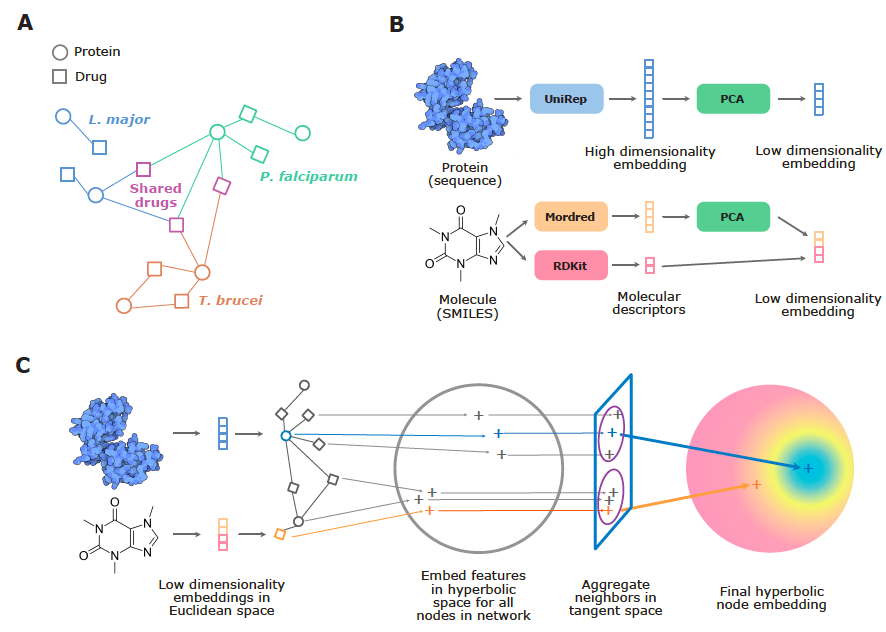

# Drug repurposing for Leishmaniasis with Hyperbolic Graph Neural Networks (HGNN-DR)

This repository contains code to run experiments from the paper "Drug repurposing for Leishmaniasis with Hyperbolic Graph Neural Networks".

## Summary

Leishmaniasis is a neglected parasitic disease affecting remote and poor tropical regions. As limited resources are allocated to combat neglected diseases, drug repurposing is an attractive and cost-effective method for developing new treatments. Here, we develop the first drug repurposing model for Leishmaniasis based on Hyperbolic Graph Neural Networks (HGNN-DR).

<p align="center">
    
</p>

HGNN-DR utilizes protein-drug interaction networks across _Leishmania major_ combined with two other eukaryotic parasites, _Plasmodium falciparum_ and _Trypanosoma brucei_. This effectively allows us to create a larger training dataset and allow our model to learn better drug representations.

HGNN-DR sees a significant performance gain over feature-based models, which do not explicitly model protein-drug network information. Compared to standard Euclidean GNN architectures (EGNN), we find that embedding protein-drug interactions using hyperbolic geometry is advantageous for drug repurposing.

Finally, we use our model to predict protein-drug interactions that could be exploited, either as a booster to increase the therapeutic effect of an existing anti-leishmaniasis drug, or as a novel chemotherapeutic treatment against the disease.


## Setup & data prep

Create a new Python 3.8 Conda environment and install the requirements:

```bash
conda create --name hgnn-dr
conda activate hgnn-dr
pip install -r requirements-python3.8.txt
```

To prepare the protein-drug interaction data as well as drug and protein features, run (from this directory)

```bash
python -m data_prep.main
```

See [data_prep/README.md](data_prep/README.md) for more details regarding the `data_prep` pipeline.

## Feature-based model baselines

To train the feature-based model baseline models, run

```bash
baselines/run_baselines.sh
```

This will perform 3-fold CV to select the best number of training iterations for logistic regression, LightGBM, XGBoost, and MLP models. Based on this, a final instance of each model will be trained and the test performance will be reported. It is also possible to save the final prediction scores for each model.

The shell script repeats this experiment is across 10 random data splits.

## HGNN-DR and EGNN baseline

To train the HGNN-DR and EGNN models, run

```bash
python gcn/train.py
```

This performs 3-fold CV to select the best number of training iterations for each model. Based on this, a final instance of each model will be trained and the test performance will be reported. It is also possible to save the final prediction scores for each model.

Random seeds for the data split and other training / modeling properties can be adjusted in `gcn/config.py`
